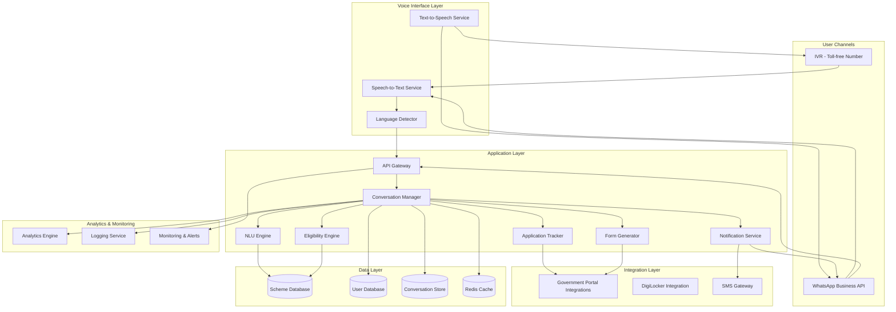
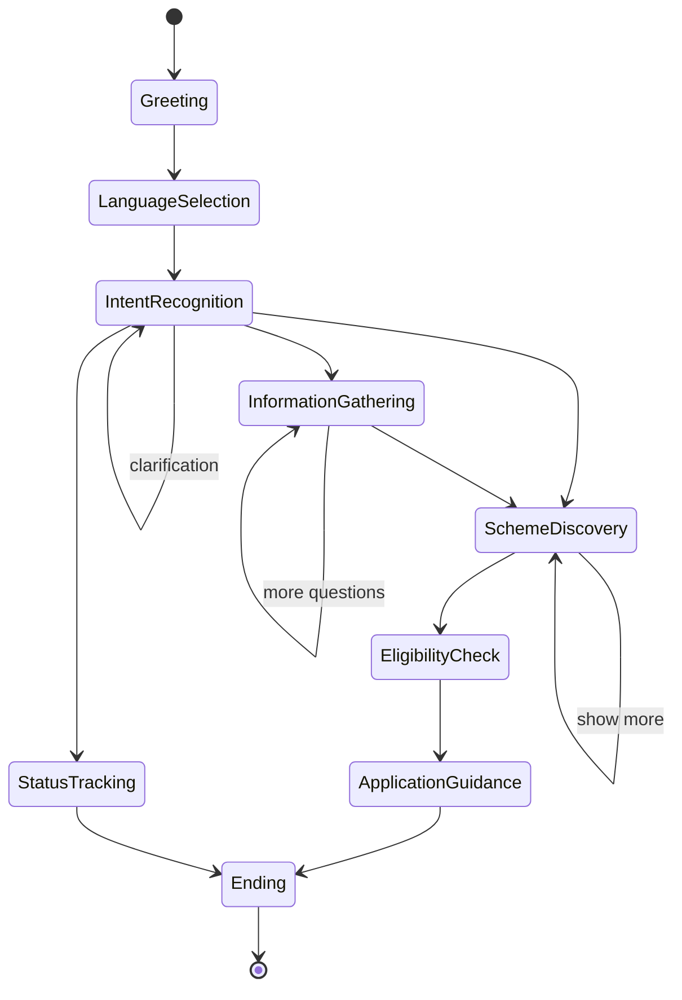

# Design Document: SarkariSahayak

## Overview

SarkariSahayak is a voice-first, multi-channel government scheme navigator built on a microservices architecture. The system processes voice input through IVR and WhatsApp channels, uses advanced NLU to understand user intent in multiple Indian languages, matches users with relevant government schemes through an intelligent eligibility engine, and guides them through the application process. The architecture prioritizes accessibility, low-bandwidth operation, and scalability to serve millions of users across India's diverse linguistic and technological landscape.

## Architecture

### High-Level Architecture



### Architecture Principles

1. **Voice-First Design**: All interactions optimized for voice input/output with text as fallback
2. **Microservices**: Loosely coupled services for independent scaling and deployment
3. **API-Driven**: RESTful APIs with webhook support for asynchronous operations
4. **Stateless Services**: Session state stored externally for horizontal scalability
5. **Cache-Heavy**: Aggressive caching of scheme data and user profiles to minimize latency
6. **Graceful Degradation**: System remains functional even when external integrations fail
7. **Multi-Tenancy**: Support for multiple government departments and states
8. **Event-Driven**: Asynchronous processing for notifications and analytics

### Technology Stack

#### Voice Processing
- **Speech-to-Text**: OpenAI Whisper (self-hosted) or Google Cloud Speech-to-Text with Indian language models
- **Text-to-Speech**: Google Cloud TTS with WaveNet voices for natural-sounding Indian language speech
- **Language Detection**: Custom model trained on Indian language audio samples

#### Communication Channels
- **WhatsApp**: WhatsApp Business API (Cloud API or On-Premises)
- **IVR**: Twilio Programmable Voice with SIP trunking
- **SMS**: Twilio SMS or local SMS gateway providers (MSG91, Gupshup)

#### Backend Services
- **API Framework**: Node.js with Express.js or Python with FastAPI
- **NLU Engine**: Rasa Open Source or Dialogflow CX with custom Indian language models
- **LLM Integration**: Claude 3.5 Sonnet or GPT-4 for complex query understanding and response generation

#### Data Storage
- **Primary Database**: PostgreSQL 15+ for structured data (schemes, users, applications)
- **Document Store**: MongoDB for conversation logs and unstructured data
- **Cache**: Redis 7+ for session state, scheme cache, and rate limiting
- **Search Engine**: Elasticsearch for full-text scheme search

#### Infrastructure
- **Cloud Provider**: AWS (primary) with multi-region deployment
- **Container Orchestration**: Kubernetes (EKS) for service management
- **API Gateway**: Kong or AWS API Gateway for routing and rate limiting
- **CDN**: CloudFront for static assets and audio file delivery
- **Message Queue**: RabbitMQ or AWS SQS for asynchronous processing

#### Analytics & Monitoring
- **Analytics**: Mixpanel or custom analytics with PostgreSQL + Metabase
- **Logging**: ELK Stack (Elasticsearch, Logstash, Kibana)
- **Monitoring**: Prometheus + Grafana
- **Error Tracking**: Sentry
- **APM**: New Relic or Datadog

## Components and Interfaces

### 1. Voice Interface Layer

#### Speech-to-Text Service
**Responsibility**: Convert voice input to text with language detection

**Interfaces**:
```typescript
interface STTService {
  transcribe(audioBuffer: Buffer, languageHint?: string): Promise<TranscriptionResult>
  detectLanguage(audioBuffer: Buffer): Promise<LanguageDetection>
}

interface TranscriptionResult {
  text: string
  confidence: number
  language: string
  duration: number
}

interface LanguageDetection {
  language: string
  confidence: number
  alternatives: Array<{language: string, confidence: number}>
}
```

**Implementation Notes**:
- Support for Hindi, English, Bengali, Tamil, Telugu, Marathi
- Noise cancellation preprocessing for low-quality phone audio
- Streaming transcription for real-time response
- Fallback to alternative STT provider if primary fails

#### Text-to-Speech Service
**Responsibility**: Convert text responses to natural speech

**Interfaces**:
```typescript
interface TTSService {
  synthesize(text: string, language: string, voiceProfile: VoiceProfile): Promise<AudioBuffer>
  getVoiceProfiles(language: string): Promise<VoiceProfile[]>
}

interface VoiceProfile {
  id: string
  language: string
  gender: 'male' | 'female' | 'neutral'
  style: 'formal' | 'conversational'
  sampleRate: number
}
```

**Implementation Notes**:
- WaveNet voices for natural prosody
- SSML support for emphasis and pauses
- Audio compression for 2G/3G networks (Opus codec)
- Caching of frequently used phrases

### 2. Conversation Manager

**Responsibility**: Orchestrate conversation flow, maintain state, coordinate with other services

**Interfaces**:
```typescript
interface ConversationManager {
  handleMessage(sessionId: string, message: UserMessage): Promise<SystemResponse>
  getSession(sessionId: string): Promise<ConversationSession>
  updateSession(sessionId: string, updates: Partial<ConversationSession>): Promise<void>
  endSession(sessionId: string): Promise<void>
}

interface UserMessage {
  text: string
  language: string
  channel: 'ivr' | 'whatsapp'
  userId: string
  timestamp: Date
}

interface SystemResponse {
  text: string
  audio?: AudioBuffer
  quickReplies?: string[]
  requiresInput: boolean
  nextAction?: string
}

interface ConversationSession {
  sessionId: string
  userId: string
  channel: 'ivr' | 'whatsapp'
  language: string
  state: ConversationState
  context: Record<string, any>
  history: Message[]
  createdAt: Date
  lastActivity: Date
}

enum ConversationState {
  GREETING = 'greeting',
  LANGUAGE_SELECTION = 'language_selection',
  INTENT_RECOGNITION = 'intent_recognition',
  INFORMATION_GATHERING = 'information_gathering',
  SCHEME_DISCOVERY = 'scheme_discovery',
  ELIGIBILITY_CHECK = 'eligibility_check',
  APPLICATION_GUIDANCE = 'application_guidance',
  STATUS_TRACKING = 'status_tracking',
  ENDING = 'ending'
}
```

**State Machine**:


### 3. NLU Engine

**Responsibility**: Extract intent and entities from user utterances

**Interfaces**:
```typescript
interface NLUEngine {
  parseIntent(text: string, language: string, context: ConversationContext): Promise<IntentResult>
  extractEntities(text: string, language: string): Promise<Entity[]>
  trainModel(trainingData: TrainingExample[]): Promise<ModelMetrics>
}

interface IntentResult {
  intent: Intent
  confidence: number
  entities: Entity[]
  alternatives: Array<{intent: Intent, confidence: number}>
}

enum Intent {
  DISCOVER_SCHEMES = 'discover_schemes',
  CHECK_ELIGIBILITY = 'check_eligibility',
  GET_APPLICATION_GUIDANCE = 'get_application_guidance',
  TRACK_APPLICATION = 'track_application',
  UPDATE_PROFILE = 'update_profile',
  GET_HELP = 'get_help',
  CHANGE_LANGUAGE = 'change_language',
  END_CONVERSATION = 'end_conversation'
}

interface Entity {
  type: EntityType
  value: string
  confidence: number
  normalized: any
}

enum EntityType {
  AGE = 'age',
  INCOME = 'income',
  OCCUPATION = 'occupation',
  LOCATION = 'location',
  GENDER = 'gender',
  FAMILY_SIZE = 'family_size',
  SCHEME_NAME = 'scheme_name',
  APPLICATION_ID = 'application_id',
  DOCUMENT_TYPE = 'document_type',
  DATE = 'date'
}
```

**Implementation Notes**:
- Custom entity recognition for Indian contexts (BPL card, Aadhaar, ration card)
- Code-mixing support (Hindi-English, Tamil-English)
- Fuzzy matching for scheme names with typos
- Context-aware entity extraction using conversation history

### 4. Eligibility Engine

**Responsibility**: Evaluate user eligibility for schemes based on criteria

**Interfaces**:
```typescript
interface EligibilityEngine {
  checkEligibility(userId: string, schemeId: string): Promise<EligibilityResult>
  findMatchingSchemes(userProfile: UserProfile, filters?: SchemeFilters): Promise<SchemeMatch[]>
  explainIneligibility(userId: string, schemeId: string): Promise<IneligibilityExplanation>
}

interface EligibilityResult {
  eligible: boolean
  confidence: number
  matchedCriteria: Criterion[]
  unmatchedCriteria: Criterion[]
  missingInformation: string[]
  score: number
}

interface SchemeMatch {
  scheme: Scheme
  relevanceScore: number
  eligibilityStatus: 'eligible' | 'likely_eligible' | 'ineligible' | 'unknown'
  matchedCriteria: Criterion[]
  estimatedBenefit: number
}

interface Criterion {
  id: string
  type: 'age' | 'income' | 'occupation' | 'location' | 'gender' | 'custom'
  operator: 'eq' | 'ne' | 'gt' | 'lt' | 'gte' | 'lte' | 'in' | 'contains'
  value: any
  required: boolean
}
```

**Eligibility Algorithm**:
1. Extract user profile attributes
2. For each scheme, evaluate criteria using rule engine
3. Calculate match score based on:
   - Number of matched required criteria (weight: 0.5)
   - Number of matched optional criteria (weight: 0.3)
   - Benefit amount relative to user income (weight: 0.2)
4. Rank schemes by score
5. Filter out schemes with unmet required criteria
6. Return top N matches

### 5. Form Generator

**Responsibility**: Generate personalized application guidance and document checklists

**Interfaces**:
```typescript
interface FormGenerator {
  generateChecklist(schemeId: string, userId: string): Promise<DocumentChecklist>
  generatePrefilledForm(schemeId: string, userId: string): Promise<FormData>
  getApplicationSteps(schemeId: string): Promise<ApplicationStep[]>
}

interface DocumentChecklist {
  schemeId: string
  schemeName: string
  documents: RequiredDocument[]
  estimatedTime: number
  submissionMethods: SubmissionMethod[]
}

interface RequiredDocument {
  id: string
  name: string
  description: string
  example: string
  mandatory: boolean
  alternatives: string[]
  whereToObtain: string
}

interface ApplicationStep {
  stepNumber: number
  title: string
  description: string
  estimatedTime: number
  helpUrl?: string
}

interface SubmissionMethod {
  type: 'online' | 'offline' | 'both'
  url?: string
  officeAddress?: string
  officeHours?: string
}
```

### 6. Application Tracker

**Responsibility**: Track application status across government portals

**Interfaces**:
```typescript
interface ApplicationTracker {
  trackApplication(applicationId: string, schemeId: string): Promise<ApplicationStatus>
  registerApplication(userId: string, schemeId: string, applicationId: string): Promise<void>
  getUserApplications(userId: string): Promise<TrackedApplication[]>
}

interface ApplicationStatus {
  applicationId: string
  schemeId: string
  status: ApplicationStatusType
  lastUpdated: Date
  statusHistory: StatusUpdate[]
  nextAction?: string
  estimatedCompletionDate?: Date
}

enum ApplicationStatusType {
  SUBMITTED = 'submitted',
  UNDER_REVIEW = 'under_review',
  DOCUMENTS_REQUIRED = 'documents_required',
  APPROVED = 'approved',
  REJECTED = 'rejected',
  DISBURSED = 'disbursed'
}

interface StatusUpdate {
  status: ApplicationStatusType
  timestamp: Date
  notes?: string
}
```

### 7. Notification Service

**Responsibility**: Send proactive notifications and reminders

**Interfaces**:
```typescript
interface NotificationService {
  scheduleReminder(userId: string, message: string, scheduledTime: Date, channel: Channel): Promise<string>
  sendImmediate(userId: string, message: string, channel: Channel): Promise<void>
  cancelReminder(reminderId: string): Promise<void>
  getUserPreferences(userId: string): Promise<NotificationPreferences>
  updatePreferences(userId: string, preferences: NotificationPreferences): Promise<void>
}

interface NotificationPreferences {
  channels: Channel[]
  quietHoursStart: string
  quietHoursEnd: string
  frequency: 'all' | 'important_only' | 'none'
}

type Channel = 'whatsapp' | 'sms' | 'voice_call'
```

## Data Models

### Scheme Entity

```typescript
interface Scheme {
  id: string
  name: string
  nameTranslations: Record<string, string>
  description: string
  descriptionTranslations: Record<string, string>
  category: SchemeCategory
  level: 'central' | 'state' | 'district'
  state?: string
  district?: string
  
  eligibilityCriteria: Criterion[]
  benefits: Benefit[]
  requiredDocuments: RequiredDocument[]
  applicationProcess: ApplicationStep[]
  
  deadlines: Deadline[]
  budget: number
  beneficiaryCount: number
  
  officialUrl: string
  helplineNumber: string
  portalIntegration?: PortalIntegration
  
  status: 'active' | 'inactive' | 'upcoming'
  createdAt: Date
  updatedAt: Date
  version: number
}

enum SchemeCategory {
  AGRICULTURE = 'agriculture',
  EDUCATION = 'education',
  HEALTH = 'health',
  HOUSING = 'housing',
  EMPLOYMENT = 'employment',
  SOCIAL_WELFARE = 'social_welfare',
  FINANCIAL_INCLUSION = 'financial_inclusion',
  WOMEN_EMPOWERMENT = 'women_empowerment',
  SENIOR_CITIZENS = 'senior_citizens',
  DISABILITY = 'disability'
}

interface Benefit {
  type: 'monetary' | 'subsidy' | 'service' | 'training'
  amount?: number
  description: string
  frequency?: 'one_time' | 'monthly' | 'annual'
}

interface Deadline {
  type: 'application' | 'document_submission' | 'verification'
  date: Date
  description: string
}

interface PortalIntegration {
  apiEndpoint: string
  authMethod: 'api_key' | 'oauth'
  supportsStatusTracking: boolean
  supportsOnlineApplication: boolean
}
```

### User Profile

```typescript
interface UserProfile {
  id: string
  phoneNumber: string
  name?: string
  age?: number
  gender?: 'male' | 'female' | 'other'
  
  location: Location
  occupation?: string
  incomeRange?: IncomeRange
  familySize?: number
  
  documents: UserDocument[]
  preferences: UserPreferences
  
  consentGiven: boolean
  consentDate?: Date
  
  createdAt: Date
  updatedAt: Date
  lastActive: Date
}

interface Location {
  state: string
  district?: string
  block?: string
  pincode?: string
}

enum IncomeRange {
  BPL = 'bpl',
  BELOW_2_LAKH = 'below_2_lakh',
  LAKH_2_TO_5 = '2_to_5_lakh',
  LAKH_5_TO_10 = '5_to_10_lakh',
  ABOVE_10_LAKH = 'above_10_lakh'
}

interface UserDocument {
  type: string
  number: string
  verified: boolean
}

interface UserPreferences {
  language: string
  preferredChannel: Channel
  notifications: NotificationPreferences
}
```

### Conversation Session

```typescript
interface ConversationSession {
  sessionId: string
  userId: string
  channel: 'ivr' | 'whatsapp'
  language: string
  
  state: ConversationState
  context: ConversationContext
  
  messages: Message[]
  
  createdAt: Date
  lastActivity: Date
  expiresAt: Date
}

interface ConversationContext {
  currentIntent?: Intent
  collectedEntities: Record<string, any>
  discoveredSchemes: string[]
  selectedScheme?: string
  pendingQuestions: string[]
  clarificationNeeded: boolean
}

interface Message {
  id: string
  role: 'user' | 'system'
  text: string
  audio?: string
  timestamp: Date
  metadata?: Record<string, any>
}
```

### Tracked Application

```typescript
interface TrackedApplication {
  id: string
  userId: string
  schemeId: string
  applicationId: string
  
  status: ApplicationStatusType
  statusHistory: StatusUpdate[]
  
  submittedAt: Date
  lastChecked: Date
  
  documents: SubmittedDocument[]
  notes: string[]
}

interface SubmittedDocument {
  type: string
  submittedAt: Date
  verified: boolean
}
```

## API Design

### Voice Webhook Endpoints

```typescript
// Twilio IVR Webhook
POST /api/v1/voice/ivr/incoming
Request: TwiML Voice Request
Response: TwiML Voice Response

POST /api/v1/voice/ivr/gather
Request: { speech: string, confidence: number }
Response: TwiML Voice Response

POST /api/v1/voice/ivr/status
Request: { callSid: string, callStatus: string }
Response: 200 OK
```

### WhatsApp Webhook Endpoints

```typescript
// WhatsApp Business API Webhook
POST /api/v1/whatsapp/webhook
Request: WhatsAppWebhookPayload
Response: 200 OK

GET /api/v1/whatsapp/webhook
Request: { hub.mode, hub.verify_token, hub.challenge }
Response: hub.challenge

interface WhatsAppWebhookPayload {
  object: 'whatsapp_business_account'
  entry: Array<{
    id: string
    changes: Array<{
      value: {
        messaging_product: 'whatsapp'
        messages?: WhatsAppMessage[]
        statuses?: WhatsAppStatus[]
      }
    }>
  }>
}
```

### Core API Endpoints

```typescript
// Scheme Search
GET /api/v1/schemes/search
Query: { q: string, category?: string, state?: string, limit?: number }
Response: { schemes: Scheme[], total: number }

// Eligibility Check
POST /api/v1/eligibility/check
Request: { userId: string, schemeId: string }
Response: EligibilityResult

// Find Matching Schemes
POST /api/v1/schemes/match
Request: { userId: string, filters?: SchemeFilters }
Response: { matches: SchemeMatch[] }

// Generate Document Checklist
GET /api/v1/schemes/:schemeId/checklist
Query: { userId: string }
Response: DocumentChecklist

// Track Application
GET /api/v1/applications/:applicationId/status
Response: ApplicationStatus

// User Profile
GET /api/v1/users/:userId/profile
Response: UserProfile

PUT /api/v1/users/:userId/profile
Request: Partial<UserProfile>
Response: UserProfile

// Conversation
POST /api/v1/conversations/:sessionId/message
Request: UserMessage
Response: SystemResponse

GET /api/v1/conversations/:sessionId
Response: ConversationSession
```

### Admin API Endpoints

```typescript
// Scheme Management
POST /api/v1/admin/schemes
Request: Scheme
Response: Scheme

PUT /api/v1/admin/schemes/:schemeId
Request: Partial<Scheme>
Response: Scheme

DELETE /api/v1/admin/schemes/:schemeId
Response: 204 No Content

// Analytics
GET /api/v1/admin/analytics/usage
Query: { startDate: string, endDate: string, groupBy: string }
Response: UsageMetrics

GET /api/v1/admin/analytics/schemes
Query: { startDate: string, endDate: string }
Response: SchemeAnalytics
```

